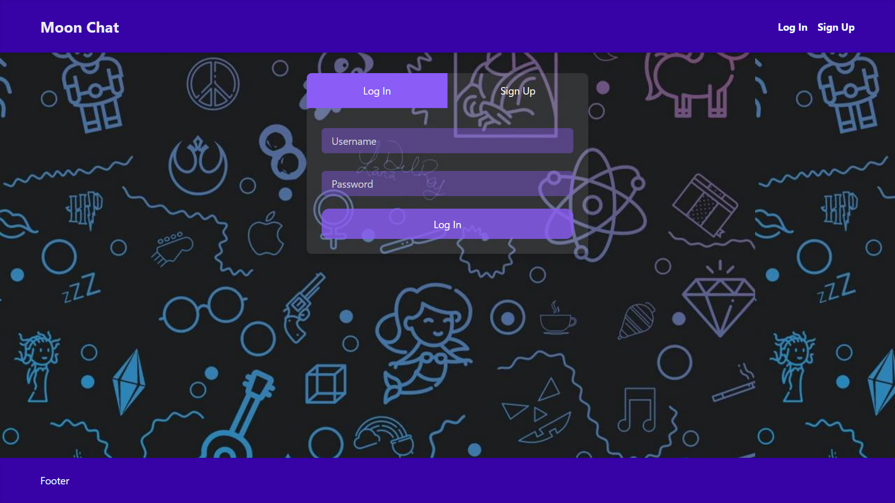
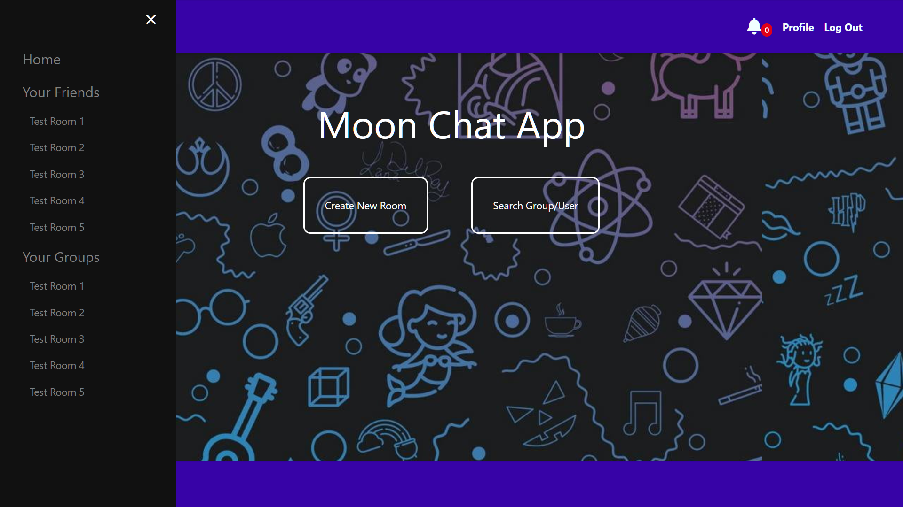
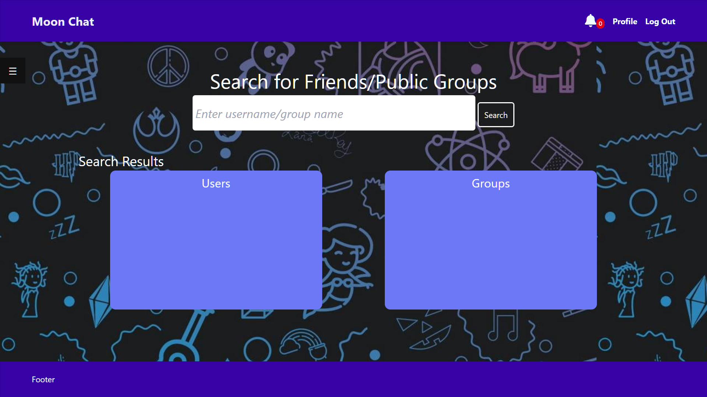
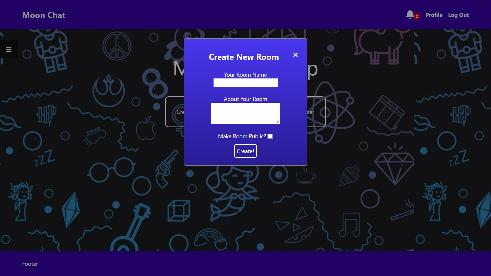

# Moon Chat
This is a simple chatting application in which we can add users as frends,  chat with friends and create and manage groups.

## Installation
Use the package manager [pip](https://pip.pypa.io/en/stable/) to install the necessary dependencies.
```bash
pip install -r requirements.txt
```

## Usage
- Clone the repository
- Inside the project folder, open terminal
- Run the following command in the terminal:
```bash
python manage.py makemigrations
python manage.py migrate
python manage.py runserver
```

## Screenshots
- Login/Signup Page


- Main Page


- Search Feature


- Create Chat Room


- Chat Room
